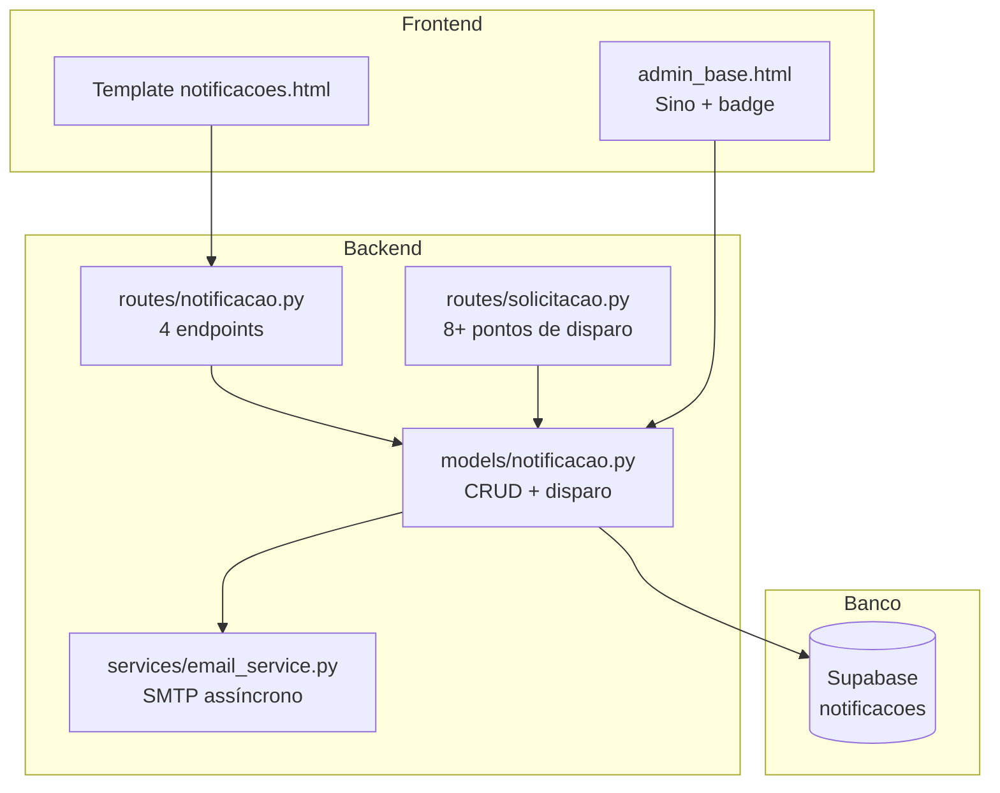
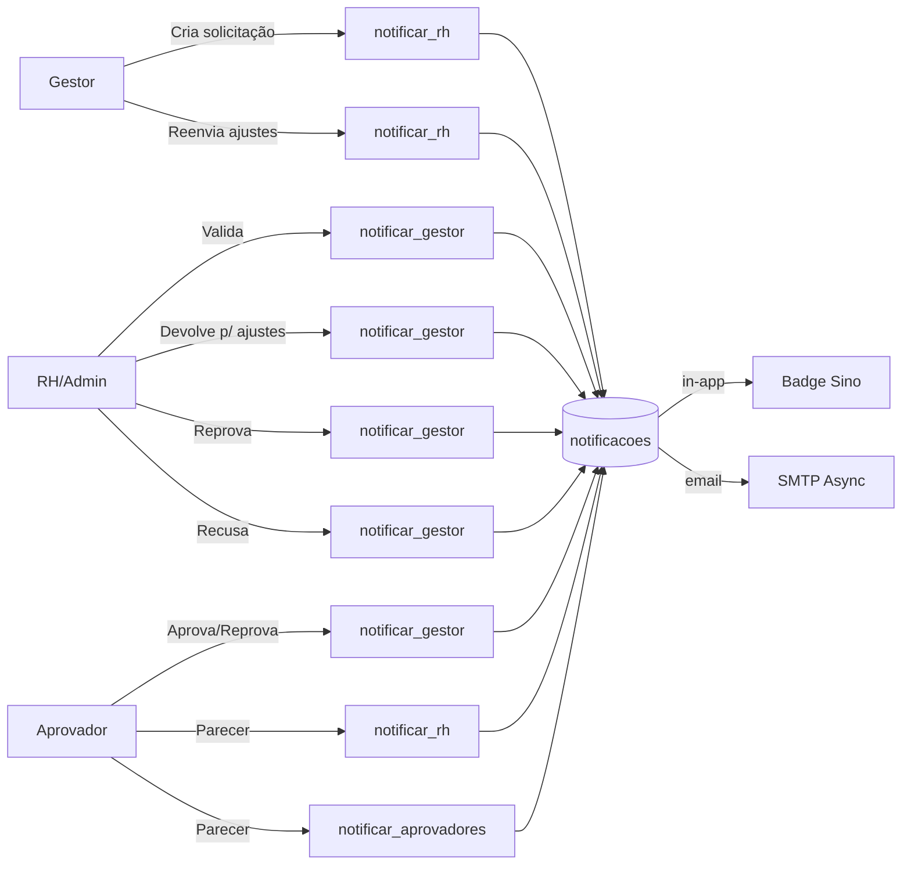
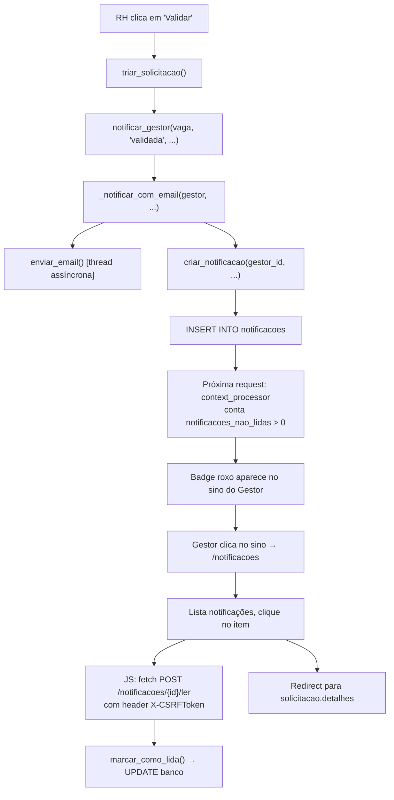

# Sistema de Notificações

## Visão Geral

Sistema de notificações in-app + email para o fluxo de solicitação de contratação.
Notifica gestores, RH/admin e aprovadores sobre eventos do pipeline.

## Arquitetura



## Fluxo Completo de Notificações



## Estrutura do Banco

Tabela `notificacoes`:

| Coluna | Tipo | Descrição |
|--------|------|-----------|
| id | uuid | PK |
| tenant_id | uuid | FK tenant |
| usuario_id | uuid | FK destinatário |
| vaga_id | uuid | FK vaga relacionada |
| tipo | text | Categoria do evento |
| titulo | text | Título exibível |
| mensagem | text | Corpo da mensagem |
| lida | boolean | Flag de leitura |
| created_at | timestamptz | Data de criação |

## Funções do Modelo (`models/notificacao.py`)

| Função | Descrição |
|--------|-----------|
| `criar_notificacao()` | Insere registro no banco |
| `notificar_gestor()` | Notifica o criador da solicitação + email |
| `notificar_rh()` | Notifica todos admin/rh/superadmin (exceto criador) |
| `notificar_aprovadores()` | Notifica todos aprovadores da solicitação |
| `listar_notificacoes()` | Últimas 50 notificações do usuário |
| `notificacoes_nao_lidas()` | Contagem para o badge do sino |
| `marcar_como_lida()` | Marca uma notificação como lida |
| `marcar_todas_como_lidas()` | Marca todas como lidas |

## Endpoints (`routes/notificacao.py`)

| Rota | Método | Função |
|------|--------|--------|
| `/notificacoes` | GET | Página de listagem |
| `/notificacoes/<id>/ler` | POST | Marcar uma como lida (AJAX) |
| `/notificacoes/ler-todas` | POST | Marcar todas como lidas (AJAX) |
| `/notificacoes/nao-lidas` | GET | Contagem para o badge (AJAX) |

## Eventos de Notificação

| Evento | tipo | Quem dispara | Quem recebe | Onde |
|--------|------|-------------|-------------|------|
| Nova solicitação | `nova_solicitacao` | Gestor | RH | `solicitacao.nova()` |
| Validação pelo RH | `validada` | RH | Gestor | `solicitacao.triar()` |
| Devolução p/ ajustes | `ajustes` | RH | Gestor | `solicitacao.triar()` |
| Reprovação pelo RH | `reprovada_rh` | RH | Gestor | `solicitacao.triar()` |
| Reenvio após ajustes | `reenviada` | Gestor | RH | `solicitacao.ajustar()` |
| Aprovação | `aprovado` | Aprovador | Gestor | `solicitacao.aprovar()` |
| Aprovação c/ ressalvas | `aprovado_ressalvas` | Aprovador | Gestor | `solicitacao.aprovar()` |
| Reprovação pelo aprovador | `reprovado` | Aprovador | Gestor | `solicitacao.aprovar()` |
| Parecer de aprovador | `parecer_aprovador` | Aprovador | RH + outros aprov. | `solicitacao.aprovar()` |
| Recusa | `recusada` | RH | Gestor | `solicitacao.recusar()` |

## Email

- Enviado **de forma assíncrona** em `threading.Thread` daemon
- Template HTML com logo, título, mensagem, link "Ver solicitação"
- Logging em sucesso e falha via `logger.error`
- Silenciado se `MAIL_USERNAME`/`MAIL_PASSWORD` não configurados

## Context Processor

`app.py` injeta `notificacoes_nao_lidas` em **todos os templates** para o badge do sino no `admin_base.html`.

## Componentes de UI

### Badge do sino

No `admin_base.html`, exibido condicionalmente:

```html

<span>{{ notificacoes_nao_lidas }}</span>

```

### Listagem (`notificacoes.html`)

- Ícone dinâmico por tipo (check verde, lápis amarelo, x vermelho, etc.)
- Tag "Nova" para não lidas
- Borda lateral roxa para não lidas
- Botão "Marcar todas como lidas" com CSRF via `X-CSRFToken`
- Click nas notificações usa `data-notificacao-id` para marcar como lida antes de redirecionar

## Exemplo de Ciclo: Validação pelo RH



## Arquivos Relacionados

| Arquivo | Papel |
|---------|-------|
| `models/notificacao.py` | Lógica central: CRUD + funções de disparo |
| `routes/notificacao.py` | Blueprint com 4 endpoints |
| `routes/solicitacao.py` | 10 pontos de disparo de notificações |
| `services/email_service.py` | Envio de email SMTP assíncrono |
| `app.py` | Context processor injeta `notificacoes_nao_lidas` |
| `templates/notificacoes.html` | Página de listagem de notificações |
| `templates/admin_base.html` | Badge do sino no topbar |
